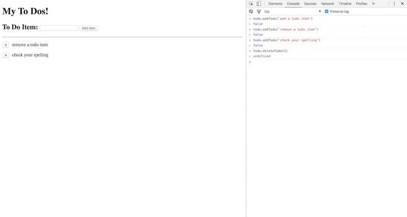

# todolist

a simple todo list with locaStorage

1-student-do-todolist.html <- contains code provided to us with 'fill in the blank' code. this code seemed very ugly and hard to read. 

todolist.html <- i re-wrote the code to make it cleaner and easier for me to understand/follow.

todolist_rmp.html <- re-wrote a second time trying out revealing module pattern
-   this version exposes two methods to the 'todo' object:
    1. addTodo() - accepts `event` if used via gui or `string` if used programatically
    - in console, type in `todo.addTodo('buy milk')`
    2. removeTodo()  - accepts `event` if used via gui or `number` if used prgrammatically
    - in console, type `todo.removeTodo(i)` where `i` is the index of the item you want to remove

